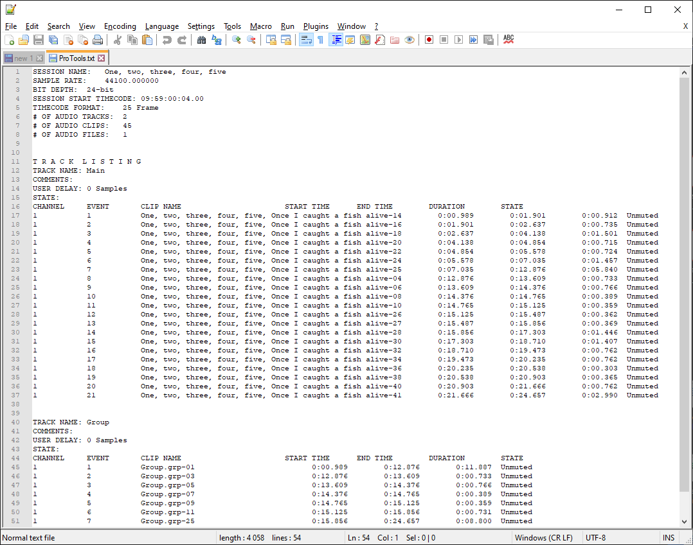
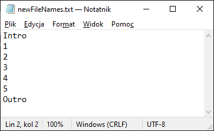
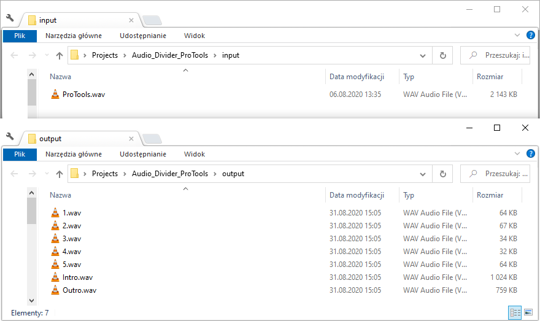

# Audio Divider

"AudioDivider" helps you divide .wav or .mp3 audio into small pieces. It requires start time and end time table from ProTools session info.

### ProTools session info

### New file names

### Input and output files

